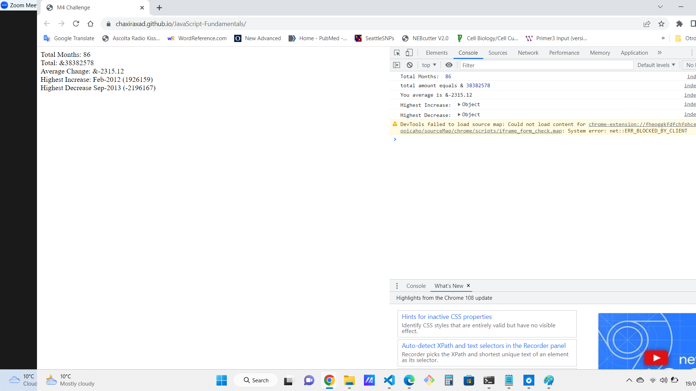

# Module-4-Challenge
JavaScript Fundamentals

## Description
Create a code for analyzing the financial dataset records of a company.

## Prerequisites
1.Create a new GitHub repo called Console-Finances. Then, clone it to your computer.

2.Copy the starter files in your local git repository.
You have been given a dataset composed of arrays with two fields, Date and Profit/Losses.
Your task is to write JavaScript code that analyzes the records to calculate each of the following:
    -The total number of months included in the dataset.
    -The net total amount of Profit/Losses over the entire period.
    -The average of the changes in Profit/Losses over the entire period.

       -You will need to track what the total change in profits are from 
         month to month and then find the average.
       -(Total/Number of months)

    -The greatest increase in profits (date and amount) over the entire period.
    -The greatest decrease in losses (date and amount) over the entire period.

## Installation
 git clone (git@github.com:Chaxiraxad/JavaScript-Fundamentals.git)

## Deployment
[Project Link] (https://chaxiraxad.github.io/JavaScript-Fundamentals/)

(ScreenShot) 

## Usage
N/A

## Credits
N/A

## License
Please refer to the LICENSE in the repository.

## Features
N/A

## Tests
N/A

## Resources
N/A